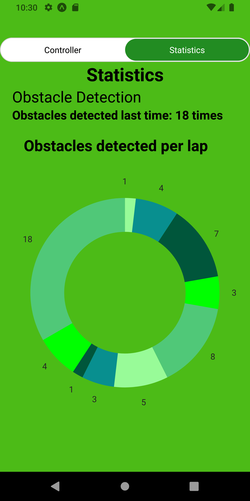

# LejosProjectMobileApp
## This project is continuation of the university project of building Restful webservices and in this version it is designed as a mobile app
The app is developed with React Native framework, it consisits of 

1. Slider to change the current speed (from 200 degrees per second to 1300),
2. Navigation Buttons to change direction: forward, backward, left, right.
3. Control Buttons: Stop the Program, Flash lights, Dance, Play random music, Pause the Program, Continue the Program.
4. Statistics (how many times was the obstacle detected)

  
  
  

